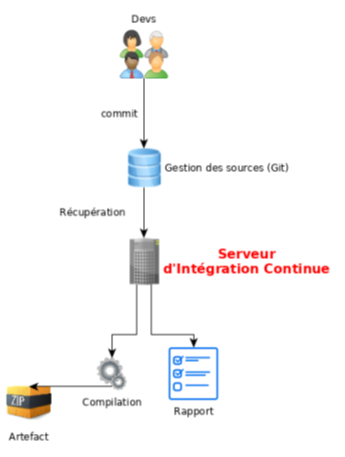

<style>
img[alt~="center"] {
  display: block;
  margin: 0 auto;
}
blockquote {
  background: #ffedcc;
  border-left: 10px solid #d1bf9d;
  margin: 1.5em 10px;
  padding: 0.5em 10px;
}
blockquote:before{
  content: unset;
}
blockquote:after{
  content: unset;
}
header {
    display: grid;
    grid-template-columns: 1fr max-content;
    background-color: #10b981;
    align-content: right;
    color: white;
    font-size: 1em;
    padding: 20px;
}
footer {
    display: grid;
    grid-template-columns: 1fr max-content;
    background-color: #10b981;
    align-content: right;
    color: white;
}

div.twocols {
  margin-top: 35px;
  column-count: 2;
}
div.twocols p:first-child,
div.twocols h1:first-child,
div.twocols h2:first-child,
div.twocols ul:first-child,
div.twocols ul li:first-child,
div.twocols ul li p:first-child {
  margin-top: 0 !important;
}
div.twocols p.break {
  break-before: column;
  margin-top: 0;
}

</style>

# 1 - Ansible Basics¶
## Learning Ansible with Rocky

---
<br/>

# :trophy: Objectives

In this chapter you will learn how to work with Ansible.

* Implement Ansible;
* Apply configuration changes on a server;
* Create first Ansible playbooks;
---
#

Ansible centralizes and automates administration tasks. It is:

* agentless
* idempotent
* SSH Protocol (Linux), WinRM Protocol (Windows), API calls

---
#

<br/>
<br/>
<br/>

:no_entry: The opening of SSH or WinRM flows to all clients from the Ansible server, makes it a **critical element of the architecture** that must be carefully monitored.


---
#

Ansible can manage differents OS, network equipments, and even containers!

* Linux,
* Windows,
* Docker,
* Network (junos, fortios, ...)
* ...

---
### Ansible functionalities

<div class="twocols">


<p class="break"></p>

Ansible is "push-based" (stateless).

</div>

---

### A little word about devops

<div class="twocols">

Optimize the work of all the teams:

  * build
  * run
  * change

<p class="break"></p>



</div>
implementing continuous integration/deployment

---
#

<br/>
<br/>
<br/>

To offer a graphical interface to your daily use of Ansible, you can install some tools like Ansible Tower (RedHat), which is not free, its opensource counterpart Awx, or other projects like Jenkins and the excellent Rundeck can also be used.

---
### The Ansible vocabulary¶

The management machine is the server on which Ansible is installed (no software is deployed on the managed servers.).

<div class="twocols">

* task
* module
* inventory
* playbook

<p class="break"></p>

* role
* fact
* handler
* collection

</div>

<!-- 
The management machine: the machine on which Ansible is installed. Since Ansible is agentless, no software is deployed on the managed servers.
The inventory: a file containing information about the managed servers.
The tasks: a task is a block defining a procedure to be executed (e.g., create a user or a group, install a software package, etc.).
A module: a module abstracts a task. There are many modules provided by Ansible.
The playbooks: a simple file in yaml format defining the target servers and the tasks to be performed.
A role: a role allows you to organize the playbooks and all the other necessary files (templates, scripts, etc.) to facilitate the sharing and reuse of code.
A collection: a collection includes a logical set of playbooks, roles, modules, and plugins.
The facts: these are global variables containing information about the system (machine name, system version, network interface and configuration, etc.).
The handlers: these are used to cause a service to be stopped or restarted in the event of a change.
-->


---
<br/>
<br/>
<br/>


# Questions ?

---
<br/>
<br/>
<br/>

# Installation on the management server

---
#
Ansible is available in the repositories of the main distributions.

On Rocky 9 / RHEL 9 (EPEL repo) :

```bash
sudo dnf install epel-release
sudo dnf makecache
sudo dnf install ansible 
```

On Debian (Launchpad repo) :

```bash
sudo apt-get install ansible
```

---
# Configuration files

The server configuration is located under `/etc/ansible`

The main configuration file (commands, modules, plugins, and ssh configuration):

```bash
/etc/ansible/ansible.cfg
```

The inventory file: (declaration of clients and groups):

```bash
/etc/ansible/hosts
```

---
# The main configuration file

`ansible-config` command generate a new configuration file:

```bash
usage: ansible-config [-h] [--version] [-v] {list,dump,view,init} ...

View ansible configuration.

positional arguments:
  {list,dump,view,init}
    list                Print all config options
    dump                Dump configuration
    view                View configuration file
    init                Create initial configuration
```

---
# The main configuration file

Example:

```bash
ansible-config init --disabled > /etc/ansible/ansible.cfg
```

---
# The inventory file

The inventory file can be written in different formats (including yaml):

Creation of a `Rocky9` group containing 2 targets:

```bash
[Rocky9]
172.16.1.210
172.16.1.211
```

---

# The inventory file

Creating a group of groups:

```bash
[rocky:children]
rocky8
rocky9
```


---
<br/>
<br/>
<br/>


# Questions ?
